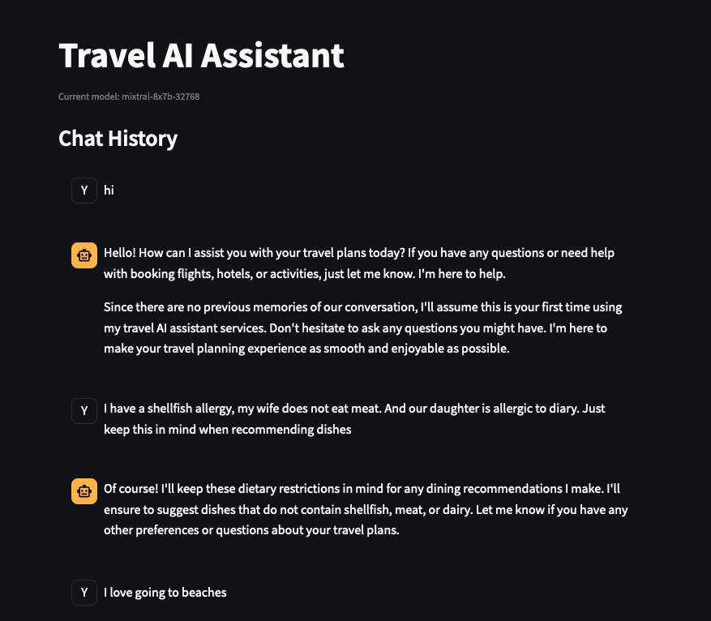
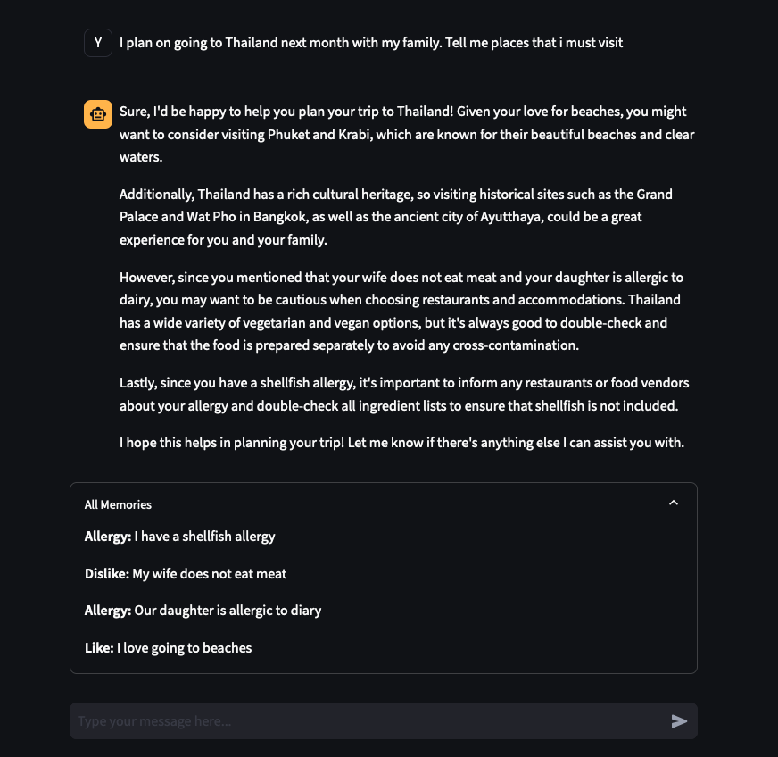

# Travel AI Assistant

## Overview

The Travel AI Assistant is a Streamlit-based chatbot that helps users plan their travels by remembering and utilizing information about their preferences, allergies, and family attributes. It uses advanced language models and a structured knowledge base to provide personalized travel recommendations.

## Features

- Interactive chat interface
- Memory retention of user preferences and information
- Categorization of knowledge into allergies, likes, dislikes, and family attributes
- Utilizes the Groq API for natural language processing
- Built with Streamlit for easy deployment and use

## Demo

### Giving things to remember

### LLM outputs answer after considering information from previous convo

